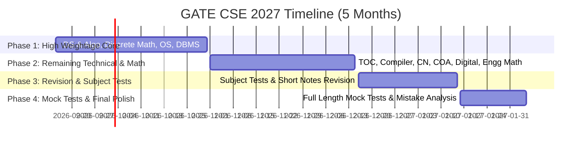

# GATE CSE 2027: 5-Month Master Preparation Roadmap

**Target Exam**: GATE Computer Science & Information Technology (CSE) 2027  
**Timeframe**: Mid-September 2026 to Early February 2027 (~5 Months / ~145 Days)

---

## 1. Exam Structure & Subject Weightage

The GATE CSE paper consists of **65 questions** worth **100 marks** over **3 hours**:
* **General Aptitude (GA)**: 15 Marks (15% of total score)
* **Engineering Mathematics & Discrete Mathematics**: ~13–15 Marks
* **Core Computer Science Subjects**: ~70–72 Marks

### Subject Priority Matrix

| Subject | Approx. Weightage | Complexity | Recommended Time | Key High-Yield Topics |
| :--- | :--- | :--- | :--- | :--- |
| **General Aptitude** | 15 Marks | Low–Medium | 30 mins daily | Numerical Ability, Spatial Aptitude, Verbal & Logical Reasoning |
| **Discrete Mathematics & Engg Math** | 13–15 Marks | Medium–High | 2 Weeks | Graph Theory, Mathematical Logic, Set Theory/Relations, Linear Algebra, Probability |
| **Data Structures & Algorithms** | 14–18 Marks | High | 2.5 Weeks | Trees (AVL, BST, Heaps), Graph Algorithms (Dijkstra, Prim/Kruskal), Dynamic Programming, Recursion, Sorting |
| **Operating Systems** | 6–9 Marks | Medium | 1.5 Weeks | CPU Scheduling, Process Synchronization (Semaphores, Mutex), Memory Management (Paging, TLB), Virtual Memory |
| **Database Management Systems (DBMS)** | 6–8 Marks | Medium | 1.5 Weeks | Normalization (BCNF, 3NF), Relational Algebra, SQL, Transactions & Concurrency Control (2PL, Serializability) |
| **Computer Networks** | 6–8 Marks | Medium–High | 1.5 Weeks | IP Addressing & Subnetting, TCP/UDP, Flow Control (Go-Back-N, Selective Repeat), Routing Algorithms, Congestion Control |
| **Theory of Computation (TOC)** | 6–8 Marks | High (Conceptual) | 1.5 Weeks | Closure Properties, DFA/NFA Construction, Context-Free Grammars, Decidability & Undecidability, Pumping Lemma |
| **Compiler Design** | 4–6 Marks | Medium | 1 Week | Parsing (LL(1), LR(0), LALR), Syntax Directed Translation (SDT), Lexical Analysis |
| **Computer Organization & Architecture (COA)** | 6–8 Marks | High (Calculations) | 1.5 Weeks | Instruction Pipelining & Hazards, Cache Memory (Direct, Set-Associative mapping), Addressing Modes |
| **Digital Logic** | 4–6 Marks | Low–Medium | 1 Week | Boolean Algebra, K-Maps, Combinational (Multiplexers, Decoders) & Sequential Circuits (Counters, Flip-Flops) |

---

## 2. Phase-by-Phase Timeline (Sept 2026 – Feb 2027)

### Phase 1: High-Yield Core Coverage (Sept 15 – Oct 31, 2026)
* **Goal**: Complete 50–55% of the total paper weightage.
* **Subjects**:
  1. Data Structures & Algorithms
  2. Discrete Mathematics & Set Theory
  3. Operating Systems
  4. DBMS
* **Strategy**: Learn concepts via standard notes/video lectures + immediate topic-wise PYQs (Previous Year Questions) from 2005 to 2026.

### Phase 2: Completion of Technical Syllabus + Engineering Math (Nov 1 – Dec 15, 2026)
* **Goal**: Cover the remaining technical syllabus and Engineering Math.
* **Subjects**:
  1. Theory of Computation + Compiler Design (Study sequentially as CD builds on TOC)
  2. Computer Networks
  3. COA & Digital Logic
  4. Linear Algebra, Calculus, Probability
* **Daily Addition**: 30–45 minutes of General Aptitude daily.

### Phase 3: Intensive Revision & Subject Test Series (Dec 16, 2026 – Jan 15, 2027)
* **Goal**: Solidify recall and problem-solving speed.
* **Daily Schedule**:
  * Morning (3 Hours): Re-read short notes & mistake log for 2 subjects.
  * Afternoon (2 Hours): Attempt 1–2 Subject-wise / Topic-wise Tests under timer.
  * Evening (2.5 Hours): Detailed test analysis + re-solve wrong/unattempted questions.

### Phase 4: Full-Length Mocks & Final Refinement (Jan 16 – Exam Day, Feb 2027)
* **Goal**: Simulate real exam environment and master time management.
* **Action Items**:
  * Take **10 to 12 Full-Length Mock Tests (FLTs)**.
  * Schedule tests at the exact GATE shift timings (9:30 AM – 12:30 PM or 2:30 PM – 5:30 PM).
  * Use **ONLY** the official GATE Virtual Calculator during practice.
  * Analyze tests using the **3-Pass Strategy**:
    * Pass 1: Quick 1-mark easy questions (30–40 mins).
    * Pass 2: Moderate 2-mark solvable questions (80–90 mins).
    * Pass 3: Hard/Calculative questions (30 mins).

---

## 3. Daily Study Routine & Time Allocation

### For Full-Time Aspirants (7–8 Hours/Day)
| Slot | Activity | Focus Area |
| :--- | :--- | :--- |
| **Slot 1 (2.5 Hours)** | Concept & Theory | Video lectures/Notes for primary subject |
| **Slot 2 (2 Hours)** | PYQ Solving | Solve 40–50 PYQs of the topic studied |
| **Slot 3 (1.5 Hours)** | Secondary Subject / Math | Engineering Math / General Aptitude practice |
| **Slot 4 (1.5 Hours)** | Daily Revision & Error Logging | Update short notes & mistake notebook |

### For College Students / Working Professionals (4–5 Hours/Day)
| Slot | Activity | Focus Area |
| :--- | :--- | :--- |
| **Morning (1.5 Hours)** | Theory Concept | High-focus topic learning before daily routine |
| **Evening (2 Hours)** | PYQ & Problem Solving | Topic-wise questions & PYQs |
| **Night (1 Hour)** | Revision & Aptitude | Short notes review + Aptitude practice |

---

## 4. Crucial Execution Rules for a 5-Month Sprint

> [!IMPORTANT]
> **Prioritize PYQs Over New Books**  
> With 5 months remaining, do NOT read standard reference textbooks cover-to-cover. Use textbooks (e.g., Cormen for Algo, Galvin for OS, Kurose-Ross for CN) strictly as reference when stuck on a specific PYQ concept.

> [!TIP]
> **Build Short Notes & a Mistake Notebook Simultaneously**  
> * **Short Notes**: Maintain 2–4 pages per subject containing only formulas, theorems, edge cases, and time complexities.
> * **Mistake Log**: Document silly numerical errors, misread questions, or tricky concepts to review every Sunday.

> [!WARNING]
> **Master MSQ (Multiple Select Questions) & NAT (Numerical Answer Type)**  
> * MSQs have **no negative marking**, but require 100% precision (partial marks are 0).
> * NAT questions require precise rounding off. Always practice calculations using an online GATE virtual calculator app/extension.

---

## 5. Recommended Resources

* **PYQ Banks**: GATE Overflow (Online platform / books for accurate solutions & discussions).
* **Reference Books (For Selective Lookups)**:
  * *Algorithms*: Introduction to Algorithms (Cormen)
  * *Discrete Math*: Kenneth Rosen
  * *Operating Systems*: Silberschatz, Galvin & Gagne
  * *Computer Networks*: Kurose & Ross / Forouzan
  * *DBMS*: Korth / Navathe
  * *Theory of Computation*: Peter Linz / Michael Sipser
* **Practice Tools**: GATE Virtual Calculator (available on web and mobile apps).
